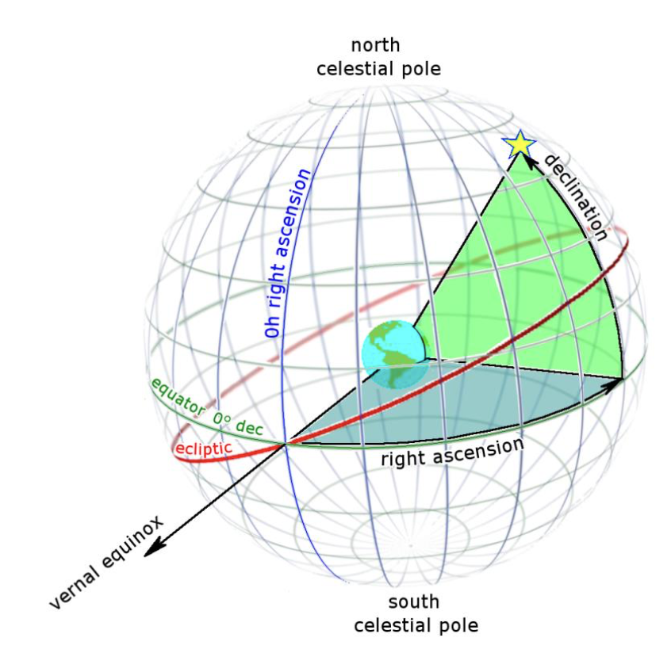

# GPU galaxies distance calculation

In this project, we write a CUDA program to compute the angles between galaxies as observed from our vantage point. Two datasets are involved: one real and another randomly generated. The objective is to compare the results to discern potential differences in the distribution of galaxies between the real and randomly generated sets, which might hint at the presence of dark matter.

## What It Does

Firstly, it's crucial to note that each line in the files contains the visual position of a galaxy, expressed as two angles in arc minutes(right ascension Alpha and declination Beta). When reading these files, the angles are converted to radians during calculations and later to degrees when creating histograms.
<p align="center">

</p>

The angle between two galaxies can never exceed 180 degrees. With a histogram bin width of 0.25, there are a total of 720 bins, ensuring a comprehensive representation.

The program calculates the angular separation for each galaxy in the real dataset against every other galaxy in both the real and fake datasets. Three histograms are created: DD (real galaxies vs. real galaxies), DR (real galaxies vs. fake galaxies), and RR (fake galaxies vs. fake galaxies).

## How It Works

### Shared Memory Usage

The CUDA kernel, `calculateHistogramAngles`, employs shared memory for efficient inter-thread communication and synchronization during histogram calculations. Specifically, subsets of galaxy data and local histograms are stored in shared memory. This enhances data accessibility and reduces global memory accesses, improving overall performance.

### Calculation Logic

The kernel calculates angles between galaxies based on their coordinates, considering both real and simulated datasets. The computed angles contribute to updating local histograms, which are later synchronized and merged into global histograms. The angle computations involve trigonometric functions and careful handling of thread indices.

### Input Data Processing

The program reads real and simulated galaxy data from input files, converting arcminutes to radians for subsequent calculations. Memory is dynamically allocated for the galaxy arrays, facilitating flexible data handling.

### Output and Cleanup

Results, including Omega values and histograms, are output to a specified file. The program also provides information about CUDA devices and records the execution time of the kernel. Memory allocated on the GPU is appropriately freed during cleanup.


## How to Run the Code

To compile, build, and run the code, you can use the provided `Makefile`. Follow the steps below:

```bash
# load modules in your cluster
module load cuda
module load GCC
```
You have to load modules if you are running this program in a cluster

```bash
# build the source code
make build
```

```bash
# run the complied executable
make run
```

```bash
# clean the compiled files and data
make clean
```

## Results

No. of Blocks: 1220704, Threads per Block: 512, Total Threads: 625000448

| Omega      | HistogramDD | HistogramDR | HistogramRR |
|------------|-------------|-------------|-------------|
| 2.365399   | 2350856     | 396662      | 1140716     |
| 1.744417   | 4356416     | 1183132     | 2673438     |
| 1.418153   | 5589018     | 1946030     | 4058226     |
| 1.215410   | 6483428     | 2673818     | 5272688     |
| 1.086647   | 7323414     | 3384896     | 6389408     |
| 1.002047   | 8173756     | 4079235     | 7468356     |

Time in GPU: 0.399956
